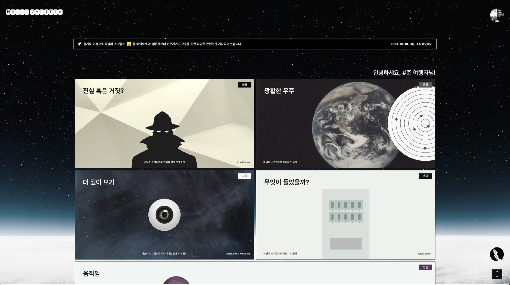

# Hello Vanilla

초보 개발자들이 재미있고 간편하게 바닐라 스크립트를 학습할 수 있도록 지원하는 교육 커뮤니티 플랫폼입니다.

## 제작 배경

이 서비스는 바로 우리의 옆에 있는 사람들이 기꺼이 사용할 만한 서비스를 만들기 위해 개발되었습니다. 당시 팀원들과 우리의 지인들은 모두 IT 학원에서 개발을 공부하던 개발자 지망생들이었으며, 자바스크립트 학습에 어려움을 겪고 있었습니다. 우리는 강사 수준의 교육을 제공할 수는 없지만, 창의적이고 개발에 대한 열정을 자극할 수 있는 콘텐츠를 제작하고 제공함으로써 중요한 역할을 할 수 있다고 생각했습니다.

프로젝트는 9월 10일부터 10월 10일까지 한 달간 진행되었습니다. 초기에는 바닐라 자바스크립트만을 사용해 모든 페이지를 만들려고 했으나, 수업 진도가 리액트까지 나가게 되면서, 팀원 모두가 프로젝트 기간 내에 실습할 기회를 놓치고 싶지 않았기에 라이브러리를 사용하게 되었으니, 이 점을 참고해주시기 바랍니다.

## 팀원 소개

<b>최준형</b> : 개발 및 디자인 총괄, Git 관리, Firebase 관리, 랜딩 페이지, 메인 페이지

 

<b>박민정</b> : Git 관리, Firebase 관리, 상세 페이지, 댓글 기능

 

<b>기범석</b> : 로그인 페이지, 회원가입 페이지, 정보수정 페이지

 

<b>김재완</b> : 상세 페이지, 애니메이션 구현

 

<b>이기운</b> : 공지사항 페이지, 퀵 링크 페이지, 게시판 페이지

 
  

## 이런 기술들이 사용되었습니다.

### 개발 환경

### 세팅

### 개발

### 데이터베이스

### 디자인

## 주요 기능

### 랜딩 페이지

찰스 팻 졸드의 저서 '코드' 에 영감을 받아 설계된 페이지 입니다. 모스부호 부터 이진법, 알파벳을 사용하는 고급 언어에 이르기까지, 코드의 역사를 한 눈에 볼 수 있도록 설계되었습니다. setInterval, setTimeout 등의 자바스크립트 비동기 함수들과 모션 애니메이션의 변칙성을 위한 랜덤 함수가 사용되었습니다.

### 메인 페이지

### 로그인 페이지

### 회원가입 페이지

### 정보수정 페이지

### 상세 페이지

### 퀵 링크 페이지

### 공지사항 페이지

### 게시판 페이지

### 404 페이지

